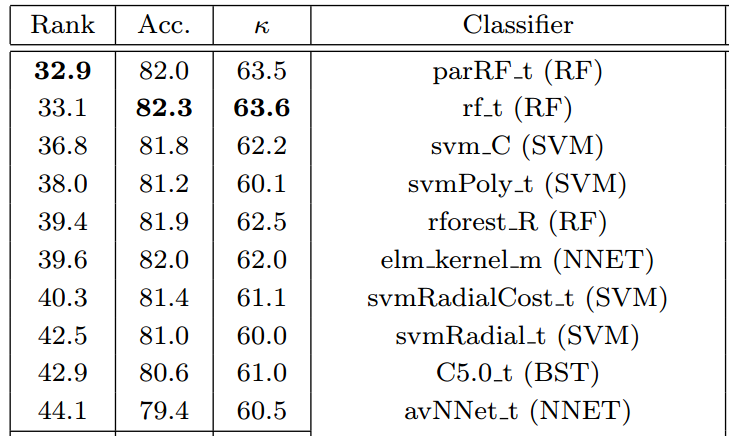
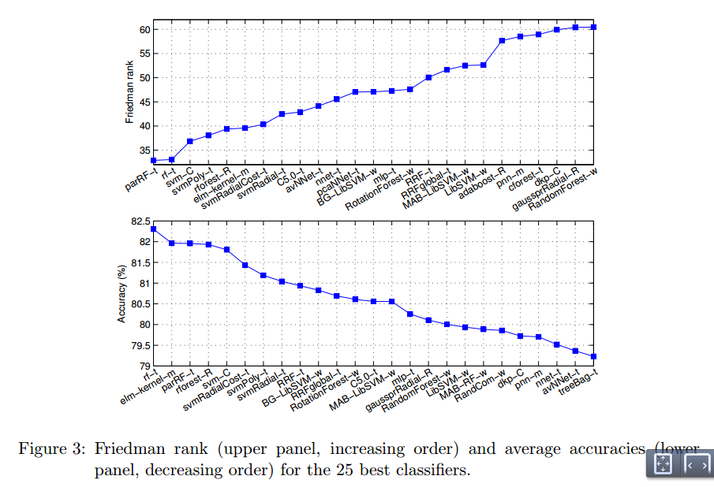
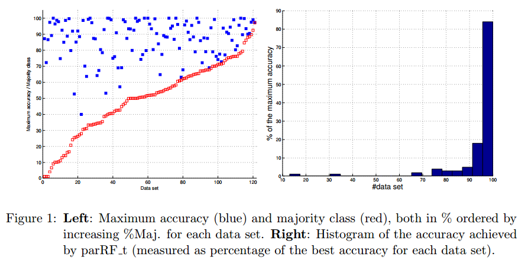
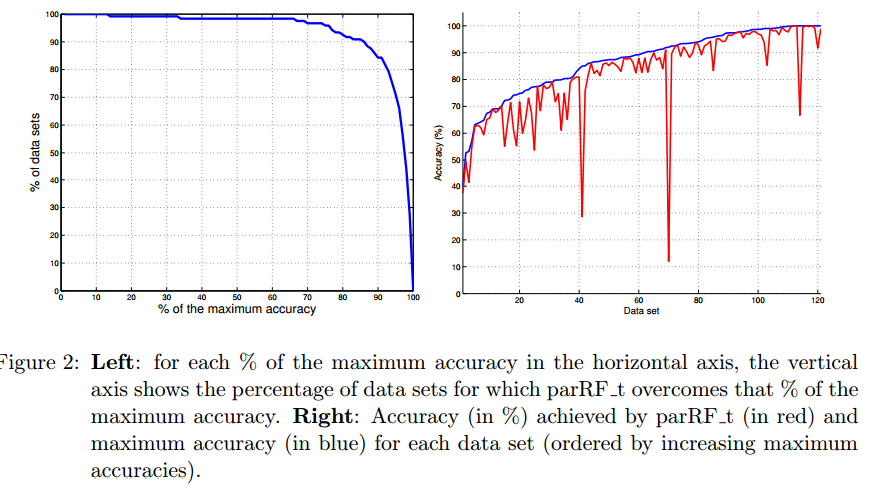
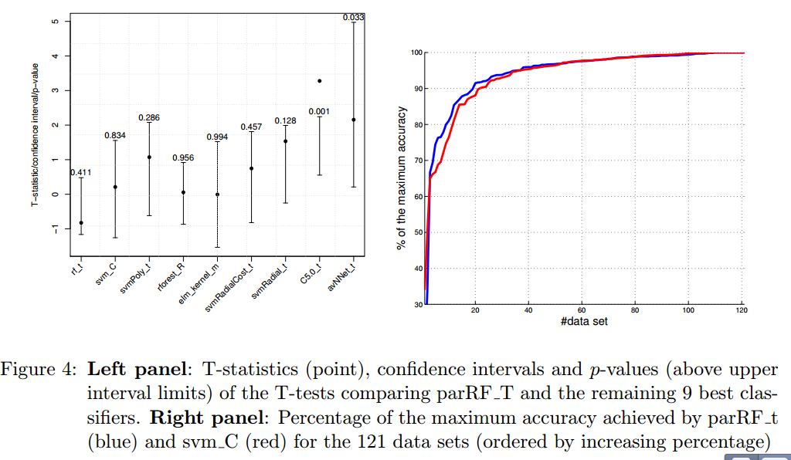
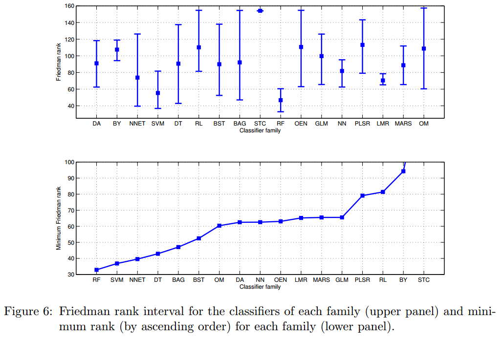

========================================================
font-import: http://fonts.googleapis.com/css?family=Risque
font-family: 'Risque'

## Do we Need Hundreds of Classifiers to Solve Real World Classification Problems?
## Fernandez-Delgado, et al (2014)


Alejandro Correa Bahnsen

February 5, 2015


Introduction
========================================================

When a researcher or data analyzer faces to the classification of a data set, he usually
applies the classifier which he expects to be **the best one**.

This expectation is conditioned by the **practicioner knowledge** about the available classifiers. 

- statistics 
- data mining
- machine learning
- computer vision
- econometrics


More Introduction
========================================================
transition: linear

The **lack of available implementation** for many classifiers is a major drawback,
although it has been partially reduced due to the large amount of classifiers implemented

- R (mainly from Statistics)
- Weka (from the data mining field)
- Matlab using the Neural Network Toolbox
- Python*


Introduction
========================================================

- usually the papers which propose a new classifier compare it only to classifiers within the **same family**,
excluding families outside the author’s area of expertise

- the comparisons are usually developed over a **few**, although expectedly relevant, data sets.

-  some classifiers with a good average performance over a reduced data
set collection could achieve significantly worse results when the collection is extended

General criticisms in experimental comparisons
===

-  The **criterion** used to select the data set collection may bias the comparison results

-  The **selection** of learners is representative enough and whether the selected learners are properly configured (tunned) to work at their best performance 

- It is still impossible to determine the **maximum attainable accuracy** for a data set,
so that it is difficult to evaluate the true quality of each classifier. 

General criticisms in experimental comparisons
===

- Since the data set complexity is unknown, we do not know if the **classification error** is caused by unfitted
classifier design or by intrinsic difficulties of the problem 

- The lack of **standard data partitioning**, defining training and testing data for crossvalidation
trials. Simply the use of different data partitionings will eventually bias the
results, and make the comparison between experiments impossible

Experimental Setup
===
type: section

- Data sets
- Algorithms

Data sets
===
- UCI 165 classification data sets
- 57 discarded
- 4  real-world data sets not in UCI
- Some UCI provide several class columns
- In total **121 data sets**

Data sets
===


```
      obs           features     
 Min.   :   16   Min.   :  4.00  
 1st Qu.:  219   1st Qu.:  6.00  
 Median :  662   Median :  9.00  
 Mean   : 6861   Mean   : 28.30  
 3rd Qu.: 2126   3rd Qu.: 23.25  
 Max.   :48842   Max.   :262.00  
```

```
    classes       %majority    
 Min.   : 2.0   Min.   :16.20  
 1st Qu.: 2.0   1st Qu.:43.23  
 Median : 2.5   Median :60.50  
 Mean   : 5.2   Mean   :56.50  
 3rd Qu.: 6.0   3rd Qu.:75.97  
 Max.   :18.0   Max.   :88.50  
```

Classifiers
===

- **179 classifiers**
- Implementation in C/C++, Matlab, R and Weka
- Groped in different families

Classifiers
===

- Discriminant analysis (DA): 20
- Bayesian (BY) approaches: 6 
- Neural networks (NNET): 21 
- Support vector machines (SVM): 10 
- Decision trees (DT): 14 
- Rule-based methods (RL): 12 
- Boosting (BST): 20 
- Bagging (BAG): 24 
- Stacking (STC): 2 
 

Classifiers
===
- Random Forests (RF): 8
- Other ensembles (OEN): 11 
- Generalized Linear Models (GLM): 5
- Nearest neighbor methods (NN): 5 
- Partial least squares and PP regression (PLSR): 6
- Logistic and multinomial regression (LMR): 3 
- Multivariate adaptive reg splines (MARS): 2
- Other Methods (OM): 10 

Experimental setup
===
- One training and one test set are generated
randomly (each with 50%). Then the **parameter are tunned**, selecting the parameter values which provide the best accuracy on the test set
- Afterwards, a **4-fold cross validation** is developed using the whole available data

- `we are aware of that this methodology may lead to poor bias and variance... We used this methodology in order to keep low the computational cost of the experimental work`

Evaluation measures
===

- Average accuracy
- Friedman ranking (Sheskin, 2006) 
- Cohen κ (Carletta, 1996)

===
type: section
# Results

Friedman rank and accuracy
===


Friedman rank and accuracy
===


Results RF
===
The best classifier is parRF t
(parallel random forest implemented in R using the randomForest and caret
packages), with rank 32.9, **average accuracy 82.0%(±16.3)** and κ=63.5%(±30.6),

followed by rf t (random forest using the randomForest package and tuned with caret), with rank 33.1 and the **highest accuracy 82.3%(±15.3)** and κ=63.6(±30.0).

Maximun accuracy and results of RF
===


Analysis RF results
===


T-test RF vs next 9
===


Analysis by family
===


===
type: section
# Conclusions

===
This paper presents an exhaustive evaluation of **179 classifiers** belonging to a wide collection of **17 families** over the whole UCI machine learning classification database

The best results are achieved by the **parallel random forest (parRF t)**, implemented in R with caret, tuning the parameter mtry, arising to **average accuracy 82.0%** 

**Six RFs and five SVMs** are included among the 20 best classifiers, which are the
bests families

## The parRF t may be considered as a reference (“gold-standard”)
